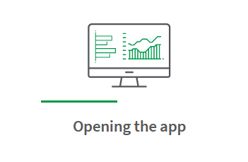
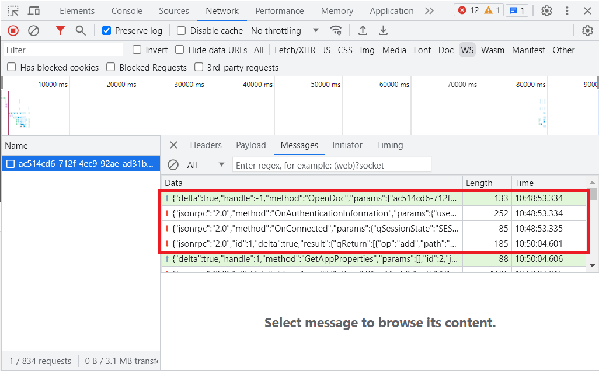
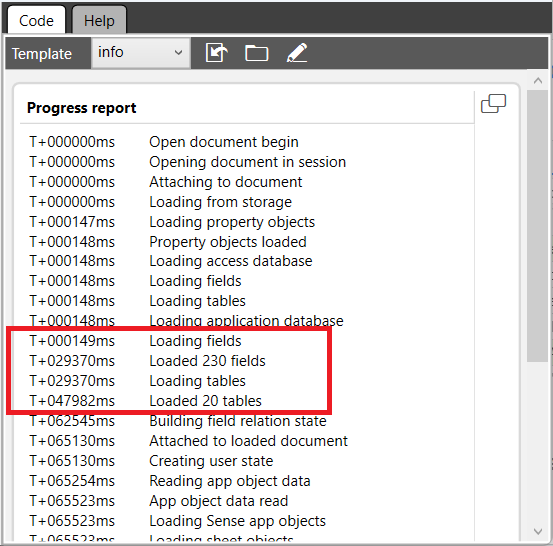
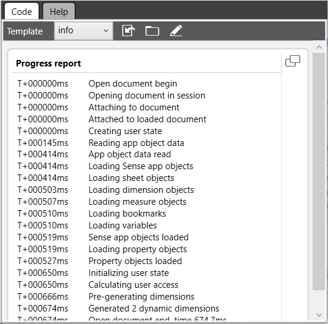
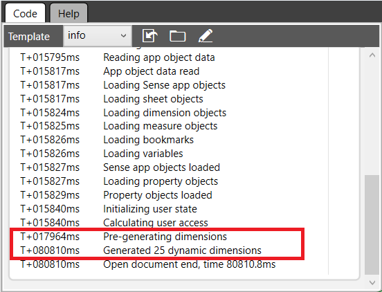

# App Open Performance <i class="fas fa-tools fa-xs" title="Tooling | Pre-Built Solutions"></i> 

{:.no_toc}

**Cadence** Ad-hoc

**Sites** production

|                                  		                      | Initial    | Recurring   |
|-----------------------------------------------------------|------------|-------------|
| <i class="far fa-clock fa-sm"></i> **Estimated Time**     | 60 min     | 60 min      |

Benefits:

  - Performance Improvement
  
-------------------------

## Goal
{:.no_toc}
The time it takes for a user to open an app will depend heavily on the state of the engine and the configuration of the app. This article focuses on how to identify bottlenecks in the app open flow and will provide some tips and trick concerning how to avoid the most common problems associated with opening apps.

## Table of Contents
{:.no_toc}

* TOC
{:toc}

-------------------------

## Initial Investigation

There are many things to consider when investigate app open performance times. When a user is concerned about how long it takes to open a given app, the first thing to determine is what stage of the app open flow that is problematic. In particular, it is important to know if it is really the opening of the app open that takes time, or if it is the rendering of the first sheet. It is often not obvious for a user opening a sheet directly how to distinguish between the two, but the next steps of the investigation, and potential improvements to peformance, will depend heavily on the answer. If rendering is where time is spent, then the sheet should have been displayed but with visuallizations indicating that they are being computed. If it is the app open stage, then this is typically what the user sees while waiting:

A more precise way of analyzing this is to look at the websocket traffic between the client and the engine. The first call the client makes when connecting to the engine is typically to make a request to open a specifc app. The following image shows a case where the call to the method "OpenDoc" is at the very first row of the communication. The response to this call can be found at row four, and is received a little over a minute after the request was first sent. This means that it took a little over a minute for the engine to open the app and prepare it for the users to start performing calculations.

This article will focus on analyzing the "OpenDoc" call. Time spent after this call should be treated as general app performance is is a topic of a different article.

## Analyzing App Open Performance

To further understand why app open times are slow it is important to find out exactly what part of the app open flow that consumes time. A great tool for analyzing this is the tool [Qlik Explorer for Developers](https://community.qlik.com/t5/Qlik-Sense-Documents/Qlik-Explorer-for-Developers/ta-p/1949809) that has a feature for providing app open progress information. 

## Cold vs Warm AppOpen

The engine goes through many stages when a user wants to attach to an app, and some of those stages will depend on whether or not the app is already loaded into memory. The following progress report shows a typical case of a "cold open", where the app has not already been loaded into memory:

Notice how much of the time (about 48 seconds in total) is spent on loading fields and tables. This is the engine reading the QVF, unpacking the data, and building the data structures required to perform calculations on the app. Compare that to the following progress report for the exact same app:

Here we can see that the loading of fields and tables are not present. In fact, if we compare line four of the two progress reports, we can see that the first one states "Loading from storage" while the second one reads "Attached to loaded document". This means that the app was alreay loaded into memory when the second connection was performed.

If users complain that apps are sometimes slow to open, then this is the first thing to look for. If it is clear that the loading of fields and tables is the main cause of slow app open times, then implementing some form of pre-caching technique in your environment might be a good option.

## Fields-on-the-fly
A stage in the app open flow that sometimes accidentally starts consuming a considerable amount of time during the app open flow is the fields-on-the-fly generation. Fields-on-the-fly is a performance optimization that greatly improves the time spent on rendering visualizations that use certain library dimensions. You can learn more about this feature here:
[Calculated Fields](https://community.qlik.com/t5/Design/Calculated-Fields/ba-p/1694383)

The feature appears in the progress report as "Pre-generating dimensions" and should typically be just a small percentage of the overall app open time. Fields-on-the-fly (FotF) is a great performance optimization in Qlik Sense, but sometimes the generation of those fields can consume a significant amount of time. Here is an example where the FotF generation consumes more than a minute out of a total of 80 seconds of app open time:

In cases like this, the next step would be to look at the master dimensions of the app and move as many of them as possible into the script instead. That would ensure that the cost of creating those fields is dealt with once, during app reload, instead of every time a user opens the app.

**Tags**

#ad-hoc

#performance

&nbsp;
